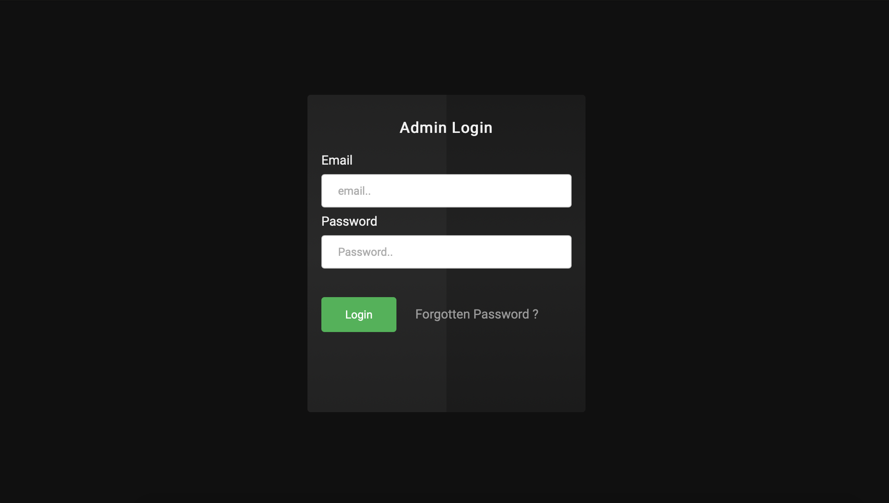
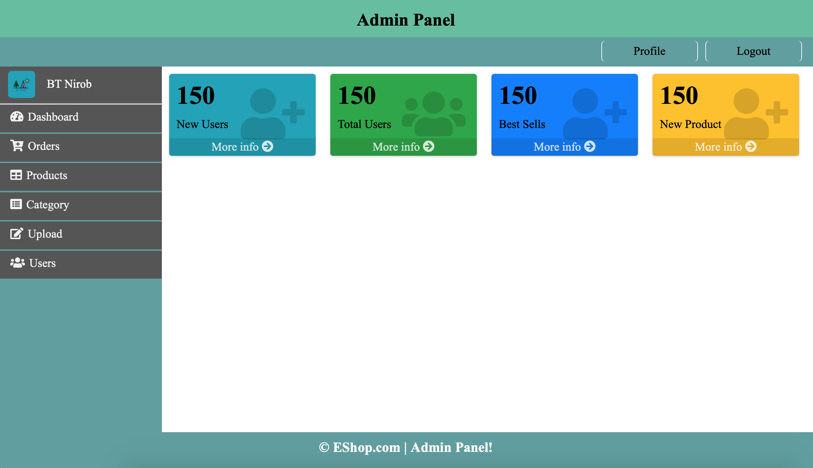
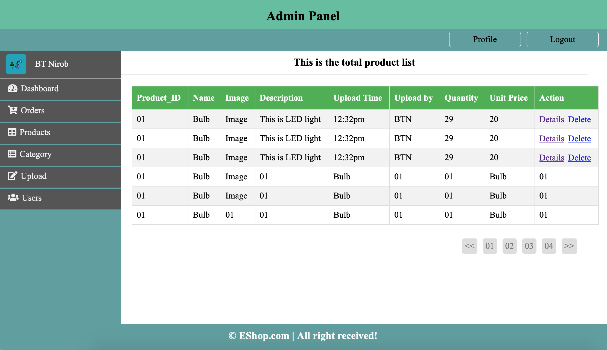
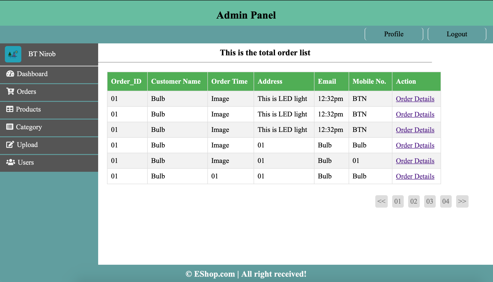
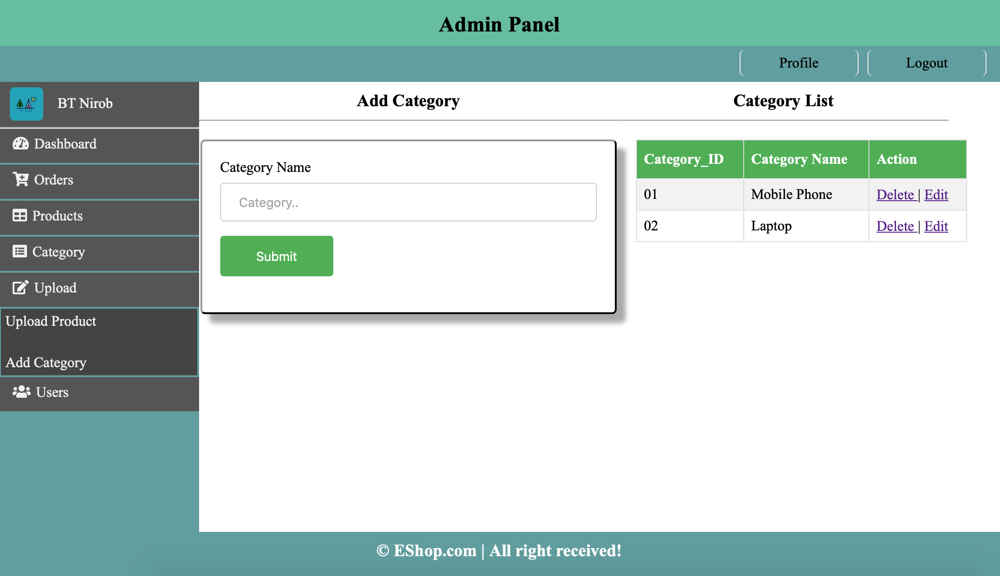

# AdminPanelDesign

  
Table of Contents

  <ol>
    <li>
      <a href="#about-the-project">About The Project</a>
      <ul>
        <li><a href="#admin-login">Admin Login Page</a></li>
        <li><a href="#admin-dashboard">Dashboard</a></li>
        <li><a href="#products">Products Page</a></li>
        <li><a href="#category">Category Page</a></li>
        <li><a href="#orders">Orders Page</a></li>
      </ul>
    </li>
    <li>
      <a href="#getting-started">Getting Started</a>
     
  </ol>

<!-- ABOUT THE PROJECT -->

## about the project

This project is just for design a simple admin panel using pure HTML,CSS, and JS.

### admin-login

   

    
   

### admin-dashboard

   

    
   

### products

   

    
   

### orders

   

    
   

### category

   

    
   

